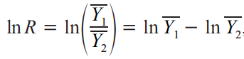
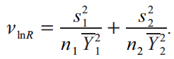
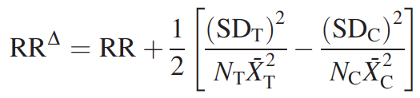
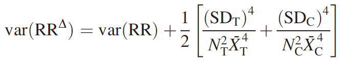
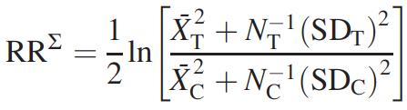
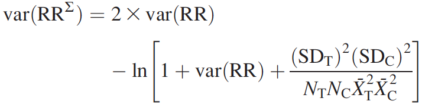
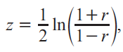
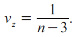
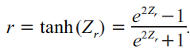

## Recapitulando  

* __Meta-Análise__: "é a análise estatística de uma ampla coleção de resultados de estudos com o propósito de integrar a evidência disponível". (_Glass, 1976_)  

* É importante determinar a sua pergunta e objetivos com clareza: **P**opulation, **I**ntervention, **C**omparison, **O**utcome - (**PICO**).  

* A extração de dados precisa ser muito bem planejada e o processo muito bem conduzido.  

* A qualidade da meta-análise depende do que você coloca nela: _garbage in, garbage out_.  

## Testes de Significância

* É o método mais utilizado para determinar a significância e importância de um efeito: "a ditadura dos valores de p".  
    + A hipótese nula raramente é realista ou plausível;
    + Dá importância demais à uma única hipótese que pode ser consistente com os dados (quando na verdade, podem existir múltiplas);
    + Trabalha com aceite ou rejeição de uma hipótese, ao invés de sua plausibilidade;
    + Sofre forte influência do tamanho amostral e de dados aberrantes.

<p align="center">
</img>
</p>

## Tamanho do Efeito

>- Tamanho do Efeito _vs_ Significância do Efeito: perspectiva da relevância de um resultado.
>- Você já usa métricas de tamanho do efeito sem saber:
    + Quando você estima o efeito de uma variável em uma regressão;
    + Quando você compara os resultados de diferentes tratamentos;
    + Quando você avalia o efeito de diferentes níveis do mesmo tratamento.
>- Em uma meta-análise, o tamanho do efeito é um parâmetro estatístico que pode ser usado para comparar, em uma mesma escala, os resultados de diferentes estudos no qual um efeito de interesse tenha sido medido.
    + Mesma resposta, medida de formas diferentes;
    + Mesma medida, expressa em unidades diferentes.

## Intervalos de Confiança

>- Interpretado como um envelope dentro do qual um parâmetro de interesse é muito plausível de estar.  
    + Se uma população for amostrada _n_ vezes, o parâmetro de interesse vai estar contido no interval de confiança de _x_% em _z_% das amostragens.  
    + Combina uma estimativa de uma característica da população em um ponto, com a variabilidade associada à esta estimativa.  
>- Dificilmente (ou nunca) um teste estatístico será significativo quando o cálculo de um intervalo de confiança sugerir que o valor do parâmetro de interesse pode ser zero.  
>- Deveria ser o foco principal ao fazermos qualquer inferência, mas não é:
    + Efeito significativo, mas impreciso: a intenção de votos é de 42 pontos, com um desvio de 41 pontos para mais ou para menos.  
    + Efeito significativo, mas muito preciso: a inteção de votos é de 42 pontos, com um desvio de 2 pontos para mais ou para menos.  

## Pensamento Meta-analítico

* Todo estudo estima o parâmetro correto que descreve a população, mas com precisão diferente.
* Portanto, o valor de cada estudo é dado pelo parâmetro estimado e pela incerteza ao redor dele.

<p align="center">
</img>
</p>

## Pensamento Meta-analítico

* Em uma meta-análise precisamos estimar dois parâmetros:
    + A métrica de effect size _per se_, que é a medida do tamanho do efeito de intesse.  
    + Uma métrica que descreva a incerteza sobre a estimativa do effect size - a _variância_.  
* Estes dois parâmetros são necessários para rodarmos qualquer modelo de meta-análise:
    + Métrica de effect size é a variável resposta (como já esperado);
    + O inverso da variância é usado para ponderar cada observação: observações mais precisas têm mais peso do que as observações com baixa precisão.  
* A falta de algum dos dados pode limitar a escolha da métrica de effect size e também o uso adequado dos modelos.  

## Tipos de Medida

>- Medidas de tamanho de efeito podem ser postas em dois grupos:
    + __Binárias__: tipo de resposta _x_ e de resposta _y_, resposta _z_ em uma população _k_,...
    + __Contínuas__: valor médio de _a_, força da relação entre _b_ e _c_,...
    
>- Medidas de efeito também podem ser usadas com diferentes objetivos:
    + __Determinar a magnitude e/ou direção de um fenômeno__: coeficientes de correlação, slopes, valores de média, predominância de um efeito...;
    + __Comparar grupos__: comparação entre médias.

>- Em ecologia, a maior parte das meta-análises envolve comparações entre grupos, mas a determinação da magnitude/direção de um fenômeno ecológico também é bastante marcante.

>- Para o cálculo de qualquer métrica de effect size e sua variância precisamos:  
    1. De uma estimativa de ponto (médias, correlações, slopes);  
    2. De uma estimativa de erro (intervalo de confiança, erro padrão, desvio padrão, variãncia);  
    3. De uma estimativa de tamanho da amostra.  

>- No R, o pacote _metafor_ oferece a função `escalc` para o cálculo de diversas métricas de effect size.  

## Hedge's _d_

* É um tipo muito comum de métrica em meta-análises na ecologia.    
* Principal objetivo é comparar grupos através de suas médias (medida contínua).  
* Também conhecido como _Standardized Mean Difference_.  
* Estimativa da diferença entre a média de dois grupos (normalmente um tratamento e um controle), padronizado pelo desvio padrão agrupado dos dois grupos e tamanho amostral.  
* Limitação: para o cálculo do valor de _d_ você precisa de estimativas de média, erro e tamanho da amostra para todos os grupos, caso contrário você não consegue calcular esta métrica de effect size.  
* Vantagem: pode ser usado com valores de média negativas.  

## Hedge's _d_

* O cálculo desta métrica de _effect size_ é feito com a fórmula:
  
<p align="center">
</img>
</p>
  
* Onde $\bar{Y}$ é a média de cada um dos grupos, _s_ é o desvio padrão de cada grupo e _n_ é o número de réplicas em cada grupo (1 e 2).  
* _J_ é um fator de correção para viés causado por baixa replicagem (o que é muito comum em estudos ecológicos), e é calculado como:
  
<p align="center">
</img>
</p>

## Hedge's _d_

* Uma vez calculada a estimativa do effect size, podemos calcular a variância associada à esta medida:
  
<p align="center">
</img>
</p>
  
* _d_ pode ter qualquer valor entre -∞ e +∞, e segue uma distribuição normal (no geral).  
* Note que esta métrica é descrita como diferença em termos de desvio padrão:
    + |_d_|≤ 0.2: efeito fraco;
    + 0.2 > |_d_| < 0.8: efeito moderado;
    + |_d_| ≥ 0.8: efeito forte.

## No R

* Vamos carregar um conjunto de dados e dar uma olhada nele.  
```{r warning=FALSE, message=FALSE}
library(metafor)
dat <- get(data(dat.normand1999))
dat
```

## No R

* Vamos calcular o valor de _d_ para cada estudo neste conjunto de dados com o `escalc`.  
* `"SMD"` especifica o calculo de _d_: **S**tandardized **M**ean **D**ifference.  
* Incorpora a correção para amostras pequenas.  

```{r warning=FALSE, message=FALSE}
escalc(measure="SMD", m1i=m1i, sd1i=sd1i, n1i=n1i, m2i=m2i, sd2i=sd2i, n2i=n2i, data=dat)
```

## Log Response Ratio

* Outro tipo muito comum de métrica em meta-análises na ecologia, que comparar grupos através de suas médias (medida contínua).  
* Estimativa da diferença pela razão entre a média de um tratamento e o controle.  
* O logarítimo natural é aplicado para normalizar a razão.  
* Pode assumir qualquer valor entre -∞ e +∞.  
* Limitação: não pode ser usado com valores de média negativas.  
* Vantagem: para o cálculo do valor de LRR você precisa somente de estimativas de média.  

<p align="center">
</img>
</p>

<p align="center">
</img>
</p>

## Log Response Ratio

* Lajeunesse (2015) demonstrou que esta formulação do LRR sofre um viés quando tamanho amostral do estudo é pequeno, e pode fornecer estimativas de variância erradas quando a escala dos parâmetros de estudo é próxima a zero (isto é, os valores de média são muito próximos a zero).  
* Sugere a utilização de dois outros estimadores para o LRR e sua variância:   
    + LRR^$\Delta$^ (baseado no Método Delta);  
    + LRR^$\Sigma$^ (baseado na regra de Expecativa de Linearidade).  
* LRR^$\Delta$^ fornece estimativas um pouco melhores do que LRR^$\Sigma$^, mas ambos são pouco eficientes quando valores da média beiram o zero.  
    
<p align="center">
</img>
</img>
</p>
<p align="center">
</img>
</img>
</p>

## No R

* Modificações de Lajeunesse (2015) não foram implementadas (e acho que não serão).  
* Vamos calcular o valor de LRR para cada estudo neste conjunto de dados com o `escalc`.  
* `"ROM"` especifica o calculo do LRR: **R**atio **o**f **M**eans.  
* O resultado pode ser expresso em %, caso você tire o exponencial do LRR.

```{r warning=FALSE, message=FALSE}
escalc(measure="ROM", m1i=m1i, sd1i=sd1i, n1i=n1i, m2i=m2i, sd2i=sd2i, n2i=n2i, data=dat)
```

## Correlação

* É valor numérico que mede o grau de associação entre duas variáveis.  
* Para o cálculo desta métrica de effect size você só precisa do coeficiente de correlação e do tamanho amostral.  
* Muito cuidado deve ser tomado quando usar esta métrica, pois:
    1. Ela se baseia no pressuposto de linearidade entre as duas variáveis independentes;  
    2. Pressupõem que não haja problemas com dados aberrantes na correlação.  
* Quando os valores de correlação são muito próximos à -1 ou +1, a distribuição dos dados tende a ficar deslocada. Neste sentido, uma opção é realizar a normalização dos dados é a conversão do valor do coeficiente de correção _r_ para o _z_ score de Fisher.  

<p align="center">
</img>
</img>
</p>

* Para trazer o valor de _z_ de Fisher de volta para o coeficiente de correção, basta usar a fórmula:

<p align="center">
</img>
</p>

## No R

* Vamos usar outro conjunto de dados, próprio para esta finalidade: `dat.mcdaniel1994`.  
* No `escalc`, `"COR"` especifica o calculo do effect size baseado no valor bruto da correlação, enquanto `"ZCOR"` o faz baseado no valor do coeficiente de correlção transformado.  
* A estimativa da variância não é afetada, uma vez que seu calculo não depende do valor de _r_.  

```{r eval=FALSE}
dat <- dat.mcdaniel1994
str(dat)
escalc(measure="ZCOR", ri=ri, ni=ni, data=dat)
```

```{r echo=FALSE}
dat <- dat.mcdaniel1994
escalc(measure="ZCOR", ri=ri, ni=ni, data=dat)[1:10,]
```

## Slopes

* Outra medida relevante que pode ser usada como _effect size_;  
* Mede a taxa de mudança em um variável dependente de acordo com uma variável independente;  
* No R (ou qualquer outro programa estatístico), este valor é representado pelo `estimate` em uma análise;  
* Muito cuidado deve ser tomado quando usar esta métrica, pois:
    1. Ela se baseia no pressuposto de linearidade;  
    2. Pressupõem que não haja problemas com dados aberrantes;
    3. Quando em um contexto de regressão múltipla, valor do _slope_ não é o mesmo do quando quando em uma regressão simples.  
* O valor do effect size é o slope em si, e o valor da variância é o valor do erro associado ao slope, elevado ao quadrado;  
* Caso a variância não seja fornecida, podemos calcular ela de outras formas (ver Capítulo 6 do livro de Meta-análise para uma explicação mais detalhada).  
    
## Outras Métricas

* Em essência, qualquer estimativa de um dado efeito pode ser usada para o cálculo do _effect size_;
* Existem diversas outras métricas disponíveis:  
    + Odds Ratio: define a razão entre a chance de um evento ocorrer em um grupo _vs_ em um segundo grupo;
    + Incidence Rate Ratio: razão entre o número de eventos específicos e o número total de eventos em uma população;
    + Estimativas de Padrões: valores que descrevam algum padrão/processo ecológico (emissão de um gás, densidade de plantas em áreas alagadas de um determinado tipo,...).  
* Para este último caso...

```{r eval=FALSE}
dat <- dat.senn2013
str(dat)
escalc(measure="MN", mi = mi, sdi=sdi, ni=ni, data=dat)
```

```{r echo=FALSE}
dat <- dat.senn2013
escalc(measure="MN", mi = mi, sdi=sdi, ni=ni, data=dat)[1:4,-4]
```

## Transformando entre métricas

* Alguns estudos podem não te fornecer os valores de média, coeficientes de correlação, slopes e estimativas de erro de forma direta.  
* Uma das opções é realizar conversões baseadas nos dados que estão disponíveis (lista completa no Capítulo 13 do livro de Meta-Análise):
    + t para _d_
    + _r_ para _d_ (e vice-versa)
    + F para _d_
    + _z_ para _d_ (e vice-versa)
    + $\chi$^2^ para _d_
    + Slope para _r_ (e vice-versa)
    + t para _r_
    + F para _r_
    + _z_ para _r_ (e vice-versa)
    + $\chi$^2^ para _r_    
    + _t_ para _z_
    
## Resumindo

* Em qualquer trabalho que fizemos, é importante considerar tanto o tamanho do efeito do que estamos medindo, quanto a incerteza existente nesta estimativa.  

* Este tipo de pensamento é essencial para passarmos uma estatística frequentista baseada em uma única hipótese, para aquela que contempla múltiplas hipóteses igualmente válidas.  

* Em uma meta-análise, é essencial calcularmos ou extrairmos uma métrica de tamanho de efeito e também a sua variância, para que o peso de cada estudo seja proporcional à sua precisão.  

* Existem vários tipos de métricas de effect size, mas a escolha de qual delas usar depende em grande parte da sua pergunta.  

* Alguns métodos específicos existem para lidar para o cálculo de effect size e sua variância quando houverem dados faltantes ou incompletos.  

## Literatura Recomendada

1. Nakagawa & Cuthill, 2007, Biol Rev, Effect size, confidence interval and statistical significance - a practical guide for biologists

2. Lajeunesse, 2015, Ecology, Bias and correction for the log response ratio in ecological meta-analysis

3. Rosenberg et al, 2013, Effect Sizes: Conventional choices and calculations, In: Handbook of meta-analysis in ecology and evolution (Capítulo 6)

4. Mengersen & Gurevitch, 2013, Using other metrics of effect size in meta-analysis, In: Handbook of meta-analysis in ecology and evolution (Capítulo 7)

5. Lajeunesse, 2013, Recovering missing or partial data from studies: a survey of conversions and imputations for meta-analysis, In: Handbook of meta-analysis in ecology and evolution (Capítulo 13)