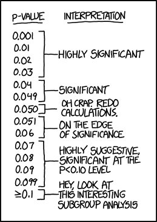
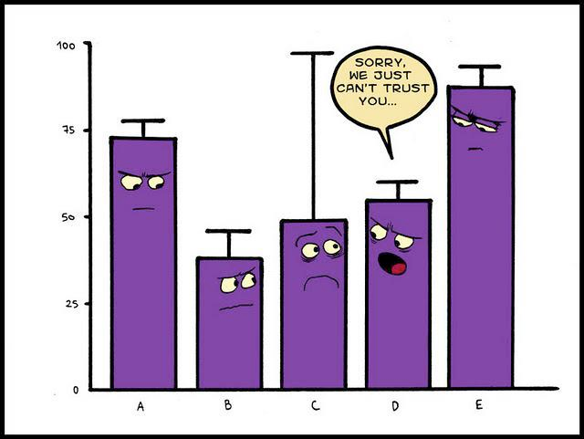
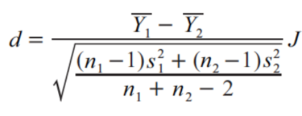
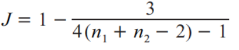
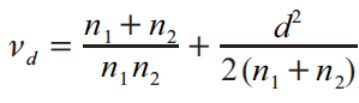

## Recapitulando  

* __Meta-Análise__: "é a análise estatística de uma ampla coleção de resultados de estudos com o propósito de integrar a evidência disponível". (_Glass, 1976_)  

* É importante determinar a sua pergunta e objetivos com clareza: **P**opulation, **I**ntervention, **C**omparison, **O**utcome - (**PICO**).  

* A extração de dados precisa ser muito bem planejada e o processo muito bem conduzido.  

* A qualidade da meta-análise depende do que você coloca nela: _garbage in, garbage out_.  

## Testes de Significância

* É o método mais utilizado para determinar a significância e importância de um efeito: "a ditadura dos valores de p".  
    + A hipótese nula raramente é realista ou plausível;
    + Dá importância demais a uma única hipótese que pode ser consistente com os dados (quando na verdade, podem existir múltiplas);
    + Trabalha com aceite ou rejeição de uma hipótese, ao invés de sua plausibilidade;
    + Sofre forte influência do tamanho amostral e de dados aberrantes.

</img>

## Tamanho do Efeito

* É um parâmetro estatístico que pode ser usado para comparar, em uma mesma escala, os resultados de diferentes estudos no qual um efeito de interesse tenha sido medido.
* Você já usa métricas de tamanho do efeito sem saber:
    + Quando você estima o efeito de uma variável em uma regressão;
    + Quando você compara os resultados de diferentes tratamentos;
    + Quando você avalia o efeito de diferentes níveis do mesmo tratamento.
* Tamanho do Efeito _vs_ Significância do Efeito.  

## Intervalos de Confiança

## Pensamento Meta-analítico

</img>

## Pensamento Meta-analítico

* Em uma meta-análise precisamos estimar dois parâmetros:
    + A métrica de effect size _per se_, que é a medida do tamanho do efeito de intesse.  
    + Uma métrica que descreva a incerteza sobre a estimativa do effect size - a _variância_.  
* Estes dois parâmetros são necessários para rodarmos qualquer modelo de meta-análise:
    + Métrica de effect size é a variável resposta (como já esperado);
    + O inverso da variância é usado para ponderar cada observação: observações mais precisas têm mais peso do que as observações com baixa precisão.  
* A falta de algum dos dados pode limitar a escolha da métrica de effect size e também o uso adequado dos modelos.  

## Tipos de Medida

>- Medidas de tamanho de efeito podem ser postas em dois grupos:
    + __Binárias__: resposta _x_ e de resposta _y_, resposta _z_ em uma população _k_,...
    + __Contínuas__: valor médio de _a_, força da relação entre _b_ e _c_,...
    
>- Medidas de efeito também podem ser usadas com diferentes objetivos:
    + __Determinar a magnitude e/ou direção de um fenômeno__: coeficientes de correlação, slopes, valores de média, predominância de um efeito...;
    + __Comparar grupos__: comparação entre médias.

>- Em ecologia, a maior parte das meta-análises envolve comparações entre grupos, mas a determinação da magnitude/direção de um fenômeno ecológico também é bastante marcante.

## Hedge's _d_

* Também conhecido como _Standardized Mean Difference_.  
* É um tipo muito comum de métrica de tamanho de efeito em meta-análises na ecologia.  
* Estimativa da diferença entre dois grupos (normalmente um tratamento e um controle), padronizado pelo desvio padrão agrupado dos dois grupos e tamanho amostral.  

</img>

</img>

</img>

## Log Response Ratio

## Correlação

## Slopes

## Outras Métricas
Rate Ratio
Odds Ratio

## Transformando entre métricas

## Resumindo

## Literatura Recomendada

1. Nakagawa & Cuthill, 2007, Biol Rev, Effect size, confidence interval and statistical significance - a practical guide for biologists

2. Rosenberg et al, 2013, Effect Sizes: Conventional choices and calculations, In: Handbook of meta-analysis in ecology and evolution (Capítulo 6)

3. Mengersen & Gurevitch, 2013, Using other metrics of effect size in meta-analysis, In: Handbook of meta-analysis in ecology and evolution (Capítulo 7)