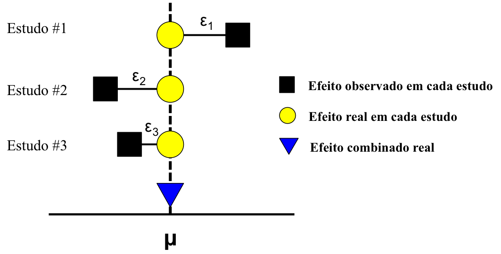
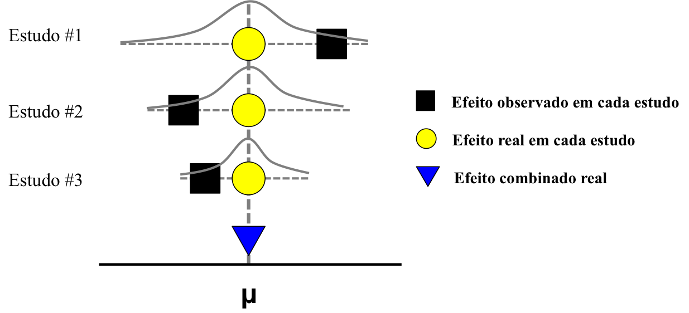
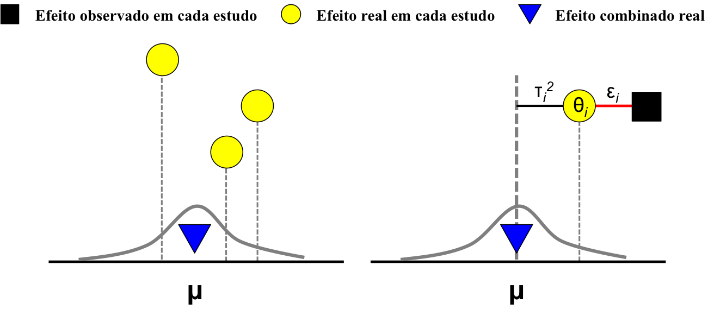

## Recapitulando  

* __Meta-Análise__: "é a análise estatística de uma ampla coleção de resultados de estudos com o propósito de integrar a evidência disponível". (_Glass, 1976_)

* É essencial extrairmos uma métrica de tamanho de efeito e também a sua variância, para que o peso de cada estudo seja proporcional à sua precisão.  
* Com estas informações, queremos chegar a um valor que defina a direção e/ou magnitude de um efeito/padrão/processo, a incerteza associada a este valor e fontes que expliquem esta heterogeneidade.

## Modelos para Meta-Análise

>- Existem diversos tipos de modelo para serem usados, cuja escolha:
    + __Reflete o objetivo da meta-análise__: estimar um efeito _vs_ explorar heterogeneidade;
    + __Define como as estimativas de cada estudo serão combinadas__: todos os estudos são iguais _vs_ estudos diferem em sua 'qualidade';
    + __Descreve as fontes de heterogeneidade entre estudos__: erro amostral _vs_ variação entre estudos;
    + __Determina o tipo de inferência que pode ser feita__: população de estudos analisada _vs_ todos os estudos, até os desconhecidos.  
>-  Desta forma, a escolha do modelo reflete o(s) objetivo(s) da sua meta-análise;  
>-  No geral, os modelos de meta-análise se dividem em dois grandes grupos: _fixed-effects models_ e _random-effects models_.  

## Fixed-effects model

* Usado para estimar a natureza de um efeito;
* Baseado no pressuposto de normalidade;
* Em um fixed-effects model, nós assumimos que:
    + Todos os estudos pertencem a uma mesma população e estão medindo a mesma coisa.  
    + A variabilidade existente é explicada unicamente por erro na amostragem em cada estudo;  
    + Varibilidade causada por diferenças entre estudos é ínfima ou inexistente.  
* Exemplo de fixed-effects model:  
<center>$\mu$ = T~i~ + $\epsilon$~i~\center

<p align="center">
</img>
</p>

## Fixed-effects model

* A incerteza na estimativa de cada estudo está contida dentro da variabilidade do efeito comum que estes estão medindo.  
* Generalizações são restritas aos estudos incluídos na meta-análise.  

<p align="center">
</img>
</p>

* Cada estudo então contribui com uma estimativa do efeito real, que deve ser ponderado pela sua imprecisão ao medir este efeito.  

## Fixed-effects models

* No geral, o peso de cada estudo (_W~i~_) em uma meta-análise é proporcional ao inverso de sua variância (s~i~): quanto maior variância de um estudo, menor o seu peso ao estimar o efeito real.  
<center>_W~i~_ = $\frac{1}{s_i}$\center
* Neste sentido, o modelo de meta-análise é semelhante à uma _weighted regression_: o efeito real é calculado com base em cada medida de effect size (ES~i~:_d~i~_, _LRR~i~_, _r~i~_,...) e o peso associado à ele (_W~i~_).  
<center>$\mu$ = $\frac{\Sigma ES_i W_i}{\Sigma W_i}$ (onde $\mu$, é o efeito efeito comum entre todos os estudos)\center
* A variância em torno de T (V~T~) é dada por:  
<center>V~T~ = $\frac{1}{\Sigma W_i}$\center
* Com isto, é possível calcular o intervalo de confiança ao redor de $\mu$, assim como realizar testes de significância com o valor estimado de $\mu$ (que segue uma distribuição normal):  

<center>95% CI = $\mu$ ± 1.96 $\sqrt{V_T}$\center  
  
<center>_z_ = $\frac{\mu}{\sqrt{V_T}}$\center  

## No R

* Vamos usar novamente o pacote `metafor`, e explorar o conjunto de dados `dat.bcg`.  
```{r message=FALSE, warning=FALSE, eval=FALSE}
library(metafor)
dat <- escalc(measure="RR", ai=tpos, bi=tneg, ci=cpos, di=cneg, data=dat.bcg)
dat
```

```{r echo=FALSE, message=FALSE, warning=FALSE}
library(metafor)
dat <- escalc(measure="RR", ai=tpos, bi=tneg, ci=cpos, di=cneg, data=dat.bcg)
knitr::kable(dat, align = 'c', format = "html")
```

## No R

* A função `rma` é utilizada para ajustar os modelos de meta-análise no `metafor`.
* `method = "FE"` diz para o `metafor` que você quer usar um fixed-effects model.

```{r}
rma(yi = yi, vi = vi, data = dat, method = "FE")
```

## Random-effects model

* Usado para estimar a natureza de um efeito;
* Baseado no pressuposto de normalidade;
* Em um random-effects model:
    + Estudos pertencem a diferentes subpopulações que compõem uma população maior: cada estudo está estimando o verdadeiro efeito em sua subpopulação.  
    + A variabilidade existente é explicada por erro na amostragem em cada estudo e por diferenças entre estudos.  
* Em um random-effects model, temos dois componenetes de variância:
    + Variância dentro dos estudos: $\epsilon$~i~ (__within-study variance__)
    + Variância entre os estudos: $\tau^2_i$ (__between-study variance__)
* Você é capaz de explorar onde existe maior variância nos resultados: dentro ou entre estudos - em outras palavras: _consistência_ ou _contingência_.  

## Random-effects model

* Em um random-effects model:  
<center>T~i~ = $\theta_i$ + $\epsilon$~i~ (efeito real em cada estudo) \center  

<center>$\mu$ = T~i~ + $\tau^2_i$ (efeito combinado real) \center  

<p align="center">
</img>
</p>

## Random-effects model  

* O efeito comum que os estudos estão medindo contém a variabilidade entre estudos e também dentro de cada estudo.
* Isto afeta diretamente a estimativa do peso de cada estudo no modelo da meta-análise:
<center>_W~i~_ = $\frac{1}{s_i + \tau^2}$\center
* Aqui, $\tau^2$ representa o componente da heterogeneidade total que é originária entre estudos (resolução dos cálculo para chegar a este valor está no Box 9.2, Capítulo 9 do livro de Meta-Análise).  
* Generalizações podem ser feitas aos estudos incluídos na meta-análise e também aqueles que são deconhecidos.  

<p align="center">
</img>
</p>

## No R

* Usando novamente o conjunto de dados `dat.bcg` do pacote `metafor`, vamos ajustar um random-effects model também com a função `rma`.  
* Neste caso, você não precisa determinar o argumento `method`: por padrão, a função usa `REML`.  

```{r}
rma(yi = yi, vi = vi, data = dat)
```

## Fixed- _vs_ Random-effects model

* Qual modelo utilizar?
    + RE é mais realístico à meta-análises em ecologia, uma vez que é impossível replicar perfeitamente os experimentos e sistemas de estudos são naturalmente diferentes;
    + No entanto, RE requer a estimativa de um parâmetro adicional relacionado à variância entre estudos, que pode ter estimativa enviesada por pequeno tamanho amostral ou número de estudos - uso de REML reduz um pouco este problema;
    + Por conta disso, intervalos de confiança estimados com RE models tendem a ser mais amplos do que aqueles estimados com FE models.
<p align="center"> 
```{r echo=FALSE}
mod1 <- rma(yi = yi, vi = vi, data = dat, method = "FE")
mod2 <- rma(yi = yi, vi = vi, data = dat)
knitr::kable(data.frame(Modelo = c("Fixed-effects model", "Random-effects model"), "Estimate" = c(mod1$b, mod2$b), "SE" = c(mod1$se, mod2$se), 
           "CI Inferior" = c(mod1$ci.lb, mod2$ci.lb), "CI Superior" = c(mod1$ci.ub, mod2$ci.ub)), format = "html", align = "c", digits = 2)
```
</p>

* Note que caso o $\tau^2$ seja 0 (ou muito próximo à zero), a estimativa do peso de cada estudo é reduzida àquela de um fixed-effects model;
* Por conta disso, se você precisa, o ideal é tentar um random-effects model e caso o valor de $\tau^2$ seja baixo aí sim adotar um fixed-effects model.

## Mixed-effects models

* É utilizado quando queremos não só estimar um efeito, mas também explorar a heterogeneidade ao redor dele;  
* Acomoda uma fração aleatória da heterogeneidade (random-effects) - causada por variância entre- e dentro- dos estudos -, assim como uma fração fixa (característica dos estudos que queremos explorar);  
* Neste sentido, ao invés de 'jogar' toda a heterogeneidade entre estudos para um termo de variância, parte dela é atribuída a _moderadores_ (veremos mais sobre isso na próxima aula);
* No R, basta usarmos a função `rma` no `metafor` e especificar a variável que queremos analisar com o argumento `mods`;
* Você também pode buscar explorar a heterogeneidade ao redor da estimativa do efeito utilizando um fixed-effects model: basta especificar o argumento `methods = "FE"` na mesma estrutura do modelo abaixo.

```{r}
dat3 <- rma(yi = yi, vi = vi, data = dat, mods = ~alloc)
```

## No R

```{r echo=FALSE}
dat3
```

## Outros modelos mais complexos

* Existem outros tipos de modelos de meta-análise que você pode encontrar por aí:
    + __Meta-Regressão__: é mais uma terminologia para representar os modelos em que a heterogeneidade é explicada por variáveis contínuas (embora algumas pessoas também usem este termo quando usam variáveis categóricas);
    + __Modelo Hierárquico ou Multivariado__: usado quando estrutura é similar à uma ANOVA aninhada ou quando existe correlação entre as observações. Em alguns casos, você acaba fazendo este tipo de modelo de forma artificial para explorar heterogeneidade em subgrupos dentro dos grupos testados (no R: `rma.mv`).  
    + __Modelo Fatorial__: usado quando a meta-análise segue um desenho fatorial.
    + __Modelo via Generalized Linear (Mixed-Effects) Models__: similar aos fixed-, random- e mixed-effects model, mas permite usar outras famílias de distribuição de variáveis aleatórias (no R: `rma.glmm`).

## Observações

* Uma alternativa ao uso do inverso da variância como o peso de cada observação é usar o _tamanho amostral_ de cada estudo: estudos maiores têm mais peso do que os estudos menores, pois tendem a ser mais precisos.  

* Recomenda-se que os intervalos de confiança para a estimativa do efeito também sejam calculados através do método do _bootstrap_ paramétrico ou não-paramétrico (ver pacote `boot`).
    + Paramétrico: 'cria' populações de effect size baseado na estimativa do efeito e da variância pelo modelo;
    + Não-paramétrico: 'cria' populações de effect size baseado nas observações existentes no conjunto de dados utilizado na meta-análise.

* Você também pode usar o _bootstrap_ para calcular intervalos de confiança para cada nível de moderadores categóricos, enquanto que para moderadores contínuos utilizar o _bootstrap_ pode ser um pouco mais complicado.

## Só para ficar didático

```{r echo=FALSE, warning=FALSE, message=FALSE, fig.align='center', fig.width=10}
library(DiagrammeR)
grViz("
digraph {
      
      graph [layout = neato]
      
      node [shape = rectangle, fontsize = 16]

      a [pos = '0,4!', label = 'Objetivo da Meta-Análise']
      b [pos = '-4,3!', label = 'Estimar um Efeito']
      c [pos = '4,3!', label = 'Explicar Heterogeneidade \n [Quero usar fatores e covariáveis para \n descrever variação entre estudos]']
      d [pos = '-6,1.5!', label = 'Fixed-Effects Model \n [Variação ocorre por heterogeneidade \n dentro dos estudos]']
      e [pos = '-2,1.5!', label = 'Random-Effects Model \n [Variação ocorre por heterogeneidade \n dentro dos estudos e entre estudos]']
      f [pos = '6,1.5!', label = 'Fixed-Effects Model  \n [Variação ocorre por heterogeneidade \n dentro dos estudos e por características \n conhecidas dos estudos]']
      g [pos = '2,1.5!', label = 'Mixed-Effects Model \n [Variação ocorre por heterogeneidade \n dentro dos estudos, entre estudos e \n suas características conhecidas]']
      h [pos = '-1,0!', label = 'Hierárquico \n [Grupos Aninhados]']
      i [pos = '2,0!', label = 'Fatorial \n [Fatores e Interações]']
      j [pos = '5,0!', label = 'Regressão \n [Variáveis Contínuas]']

      a->b
      a->c
      b->d
      b->e
      c->f
      c->g
      g->h
      g->i
      g->j
      }
      ")
```

## Resumindo

* Existem diversos tipos de modelos que podem ser usados em uma meta-análise, cada um com um tipo de característica e uso próprio;  
* Não existe o melhor modelo para a sua meta-análise, mas sim o modelo que descreve melhor seus objetivos e perguntas;  
* Independente do modelo que você use, é boa prática ponderar cada observação/estudo pelo inverso de sua variância.  

## Literatura Recomendada

1. Nakagawa & Santos, 2012, Evol Ecol, Methodological issues and advances in biological meta-analysis

2. Harrison, 2011, Methods Ecol Evol, Getting started with meta-analysis

3. Mengersen et al, 2013, Statistical models and approaches to inference, In: Handbook of meta-analysis in ecology and evolution (Capítulo 8)

4. Rosenberg, 2013, Moment and least-squares based approaches to meta-analytic inference, In: Handbook of meta-analysis in ecology and evolution (Capítulo 9)

5. Mengersen & Schmid, 2013, Maximum likelihood approaches to meta-analysis, In: Handbook of meta-analysis in ecology and evolution (Capítulo 10)

<script type="text/x-mathjax-config">
   MathJax.Hub.Config({  "HTML-CSS": { minScaleAdjust: 135, availableFonts: [] }  });
</script>