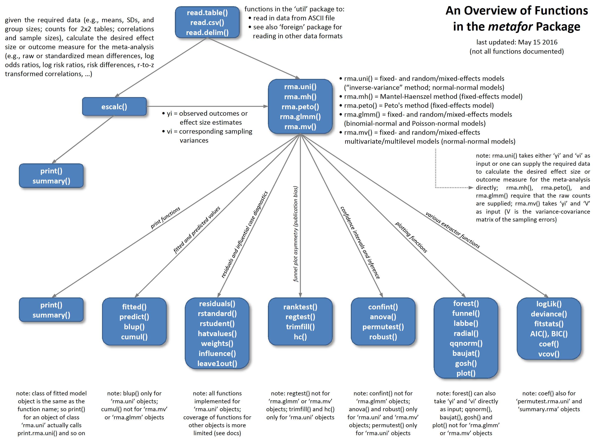

## Recapitulando  

* __Meta-Análise__: "é a análise estatística de uma ampla coleção de resultados de estudos com o propósito de integrar a evidência disponível". (_Glass, 1976_)

* Em uma meta-análise, é essencial calcularmos ou extrairmos uma métrica de tamanho de efeito e também a sua variância, para que o peso de cada estudo seja proporcional à sua precisão.  

* Não existe o melhor modelo para a sua meta-análise, mas sim o modelo que descreve melhor seus objetivos e perguntas.  

* Documente todas as decisões e escolhas que você fizer durante o processo de seleção de trabalhos, extração de dados, cálculo de effect size e escolha dos modelos.  

## Rodar um modelo não é ter um modelo

>- Existem certos pressupostos que você precisa verificar para saber se o que o modelo promete é de fato real.
    + Distribuição dos resíduos segue distribuição normal;  
    + Variância dos resíduos é homogênea entre grupos ou ao longo de um gradiente (válido somente quando incluímos moderadores);  
    + Os resultados não estão sendo tendenciados por observações aberrantes.  
>- Além disso, o modelo de meta-análise possui métricas específicas que devem ser verificadas para determinar:
    + Extensão da heterogeneidade entre observações;
    + Extensão da heterogeneidade dentro das observações;
    + Heterogeneidade total e heterogeneidade explicada pelo modelo;
    + Heterogeneidade explicada por cada _moderador_;
    + Diferença entre os níveis do mesmo _moderador_.
>- O que vale para modelos de ANOVA, Regressão, e etc, valem e funcionam de forma semelhante aqui.

## Validação do Modelo

* A promessa do modelo é real ou furada?  
* Vamos trabalhar com essa ideia usando um exemplo prático diretamente no R, com os dados que temos trabalhado no `metafor`.  

```{r warning=FALSE, message=FALSE}
library(metafor)
dat <- dat.bcg
dat <- escalc(measure="RR", ai=tpos, bi=tneg, ci=cpos, di=cneg, data=dat.bcg)
model1 <- rma(yi = yi, vi = vi, data = dat)
```

## Validação do Modelo | Normalidade dos Resíduos

* Método gráfico _vs_ método estatístico.  

```{r eval=FALSE}
qqnorm.rma.uni(model1)
hist(rstudent.rma.uni(model1)$resid, xlab = "Resíduos", main = "Distribuição dos Resíduos")
boxplot(resid(model1), ylab = "Resíduos", main = "Distribuição dos Resíduos em um Box Plot")
```

```{r echo=FALSE, fig.width=9, fig.height=3, fig.align='center'}
par(mfrow = c(1,3))
qqnorm.rma.uni(model1)
hist(rstudent.rma.uni(model1)$resid, xlab = "Resíduos", main = "Distribuição dos Resíduos")
boxplot(resid(model1), ylab = "Resíduos", main = "Distribuição dos Resíduos em um Box Plot")
```

## Validação do Modelo | Influência das Observações

* Diversos métodos disponíveis:
    + __Leave-One-Out__: exclui uma observação por vez, e determina como esta exclusão afeta a estimativa do parâmetro de interesse, bem como o ajuste do modelo.  
    
```{r eval=FALSE}
leave1out.rma.uni(model1)
```

```{r echo=FALSE}
l1o <- data.frame(ids = leave1out.rma.uni(model1)$slab, estimate = leave1out.rma.uni(model1)$estimate, se = leave1out.rma.uni(model1)$se, 
                  zval = leave1out.rma.uni(model1)$zval,  pval = leave1out.rma.uni(model1)$pval, ci.lb = leave1out.rma.uni(model1)$ci.lb, 
                  ci.ub = leave1out.rma.uni(model1)$ci.ub, Q = leave1out.rma.uni(model1)$Q, Qp = leave1out.rma.uni(model1)$Qp, 
                  tau2 = leave1out.rma.uni(model1)$tau2, I2 = leave1out.rma.uni(model1)$I2, H2 = leave1out.rma.uni(model1)$H2)
knitr::kable(l1o, digits = 3, format = "html", align = "c")
```

## Validação do Modelo | Influência das Observações

* Diversos métodos disponíveis:
    + __Externally Standardized Residuals__: é o desvio entre o desvio observado para o caso _i_ e aquele predito pelo modelo, após este caso ter sido excluído (resíduo muito grande indica que o caso não se ajusta ao modelo).  
    
```{r eval=FALSE}
influence.rma.uni(model1)
```

```{r echo=FALSE}
inf <- data.frame(ids = influence.rma.uni(model1)$ids, influence.rma.uni(model1)$inf, influence.rma.uni(model1)$dfbs)
colnames(inf)[10] <- "dfbs"
knitr::kable(inf, digits = 2, format = "html", align = "c")
```

## Validação do Modelo | Influência das Observações

* Diversos métodos disponíveis:
    + __dffits__: estima quantas unidades de desvio padrão o efeito do predito pelo caso _i_ muda após sua exclusão durante o ajuste do modelo.  
    + __dfbetas__: estima quantas unidades de desvio padrão o coeficiente predito muda após a exclusão do caso _i_.  
    
```{r eval=FALSE}
influence.rma.uni(model1)
```

```{r echo=FALSE}
knitr::kable(inf, digits = 2, format = "html", align = "c")
```

## Validação do Modelo | Influência das Observações

* Diversos métodos disponíveis:
    + __Cook's Distance__: variação na possibilidade de valores que uma parâmetro pode assumir, uma vez que o caso _i_ seja excluído.  
    + __Hatvalues__: influência de cada caso _i_ na estimativa do parâmetro de interesse.  
    
```{r eval=FALSE}
influence.rma.uni(model1)
```

```{r echo=FALSE}
knitr::kable(inf, digits = 2, format = "html", align = "c")
```

## Validação do Modelo | Influência das Observações

* Diversos métodos disponíveis:
    + __Weights__: peso de cada estudo no modelo (em %) (pouco relevante se você explicitamente determinou os pesos à serem usados).  
    + __Covariance Ratio__: efeito do caso _i_ na variânca do modelo (valores > 1 indicam que estudo aumenta variância do modelo).  
    
```{r eval=FALSE}
influence.rma.uni(model1)
```

```{r echo=FALSE}
knitr::kable(inf, digits = 2, format = "html", align = "c")
```

## Validação do Modelo | Influência das Observações

* Diversos métodos disponíveis:
    + __$\tau^2$__: heterogeneidade entre estudos  (between-study variance) quando o caso _i_ é excluído.  
    + __QE__: heterogeneidade residual quando caso _i_ é excluído (veremos mais sobre QE a seguir).  
    
```{r eval=FALSE}
influence.rma.uni(model1)
```

```{r echo=FALSE}
knitr::kable(inf, digits = 2, format = "html", align = "c")
```

## Validação do Modelo | Influência das Observações

* Algumas diretrizes para considerar estudos influentes (_n_ = graus de liberdade, _p_ = número de coeficientes no modelo, _k_ = número de estudos):
    + dffits > 3$\sqrt\frac{p}{k-p}$
    + dfbetas > 1
    + Cook's Distance corta mais que 50% da área da cauda de uma distribuição $\chi^2$ com _n_ graus de liberdade;
    + Hatvalues > 3$\frac{p}{k}$
* Estas diretrizes não são uma receita de bolo, e julgamento crítico dos valores deve ser exercitado.  

## Diagnóstico do Modelo

* O output de um modelo de meta-análise: parte a parte.  

```{r}
model1
```

## Diagnóstico do Modelo | Estimativas do Modelo

```{r echo=FALSE}
valores <- data.frame(estimate = model1$b, se = model1$se, zval = model1$zval, pval = model1$pval, ci.lb = model1$ci.lb, ci.ub = model1$ci.ub)
row.names(valores) <- 1
knitr::kable(valores, digits = 3, format = "pandoc", align = "c")
```
  
* __Estimate__: é a estimativa do efeito que você está interessado.  
* __SE__: é o valor do erro associado à estimativa do efeito (utilizado para os testes de significância e cálculo do intervalo de confiança).
* __zval__: valor do teste estatístico deste termo no modelo.
* __pval__: valor de _p_ para o teste estatístico.  
* __CI__: intervalo de confiança inferior (_ci.lb_) e superior (_ci.lb_) da estimativa do efeito.

## Diagnóstico do Modelo | Variância dos Random-Effects

```{r echo=FALSE}
valores <- cbind(valores, tau2 = model1$tau2, se.tau2 = model1$se.tau2)
knitr::kable(valores, digits = 3, format = "pandoc", align = "c")
```

* __$\tau^2$__: variância entre estudos (between-study variance) e erro associado à esta estimativa (_se.tau2_).  
* $\tau^2$ é estimado por REML, por conta disso, possui um erro associado à ela.
* Você pode verificar o ajuste de $\tau^2$ com o log-likelihood usando a função `profile.rma.uni`: deve haver um pico no gráfico.  

```{r echo=FALSE, fig.align='center', fig.height=3, fig.width=3, message=FALSE, results='hold'}
profile.rma.uni(model1)
```

## Diagnóstico do Modelo | Testes de Heterogeneidade

* Uma estimativa de heterogeneidade na meta-análise é dada pela estatística Q, medida de forma similar à soma dos quadrados em uma ANOVA.  
* A heterogeneidade total em um modelo de meta-análise é denotado por Q~TOTAL~ ou Q~T~.  
* Q~T~ é a estatística de teste da hipótese nula (H~0~) de que todos os estudos formam uma amostra homogênea de uma população com efeito real $\mu$ - isto é, _não existe heterogeneidade nos estudos_.  
    + Aceita H~0~: não existe heterogeneidade;  
    + Rejeita H~0~: existe evidência de heterogeneidade nos estudos.  
* Q~T~ é testado com base em uma distribuição do $\chi^2$ com _k_ - 1 graus de liberdade.  
* Importante (mais sobre esses tópicos à seguir):
    + Q~T~ representa a heterogeneidade oriunda da varibilidade de dentro (within-study variance) dos estudos em um fixed-effects model, e variabilidade oriunda de dentro (within-study variance) e entre (between-study variance) os estudos em um random-effects model.  
    + Q~T~ não deveria ser estatisticamente significativo em um random-effects model, pois toda a heterogeneidade adicional está sendo 'jogada' para a variabilidade entre estudos.  

## Diagnóstico do Modelo | Testes de Heterogeneidade

* No output que estamos trabalhando, o valor de Q não representa o valor de Q~T~, mas sim o de Q causado por variância dentro dos estudos (Q~E~).  
* A estatística Q não é comparável entre meta-análises e, por ser uma análise estatística, seu poder depende da quantidade de estudos incluídos.  
* Uma alternativa complementar de medida de heterogeneidade é o I^2^, que quantifica a porcentagem total da heterogeneidade que pode ser atribuído à variabilidade entre estudos.  
  
<center>I^2^: _max_ (100 x $\frac{Q_T - (K - 1)}{Q_T}$, 0)  
(onde K é o número de estudos/graus de liberdade)\center
  
```{r echo=FALSE}
valores <- cbind(valores,  QE = model1$QE, QEp = model1$QEp, I2 = model1$I2)
knitr::kable(valores, digits = 3, format = "pandoc", align = "c")
```

## Diagnóstico do Modelo | Testes de Heterogeneidade

* Por fim, H^2^ é uma outra métrica complementar de heterogeneidade que representa o quanto cada estudo está contribuindo para a heterogeneidade do do modelo.  
  
<center>H^2^: $\frac{Q_T}{K - 1}$\center

```{r echo=FALSE}
valores <- cbind(valores, H2 = model1$H2)
knitr::kable(valores, digits = 3, format = "pandoc", align = "c")
```

## Diagnóstico do Modelo: Mixed-effects model

```{r}
(model2 <- rma(yi = yi, vi = vi, data = dat, mods = ~ ablat))
```

## Mixed-effects model | Estimativas do Modelo  

* Note algumas diferenças no modelo de meta-regressão (mixed-effects model):
    + Você agora recebe um valor para o intercepto e slope do efeito da latitude;  
    + Assim como em um regressão, você tem acesso à uma estimativa de R^2^ (explicação do modelo);
    + O output agora te dá uma estimativa de QM (ou Q~b~, between-study variance) e QE (ou Q~w~, within-study variance);
    + Todas as estimativas de variabilidade não explicada caíram: $\tau^2$, I^2^ e Q^2^.  

```{r echo=FALSE}
mixef <- data.frame(modelo = rep("mixed-effects model", 2), variavel = c("Intecepto", "Latitude"), estimate = model2$b, se = model2$se, zval = model2$zval, pval = model2$pval, ci.lb = model2$ci.lb, ci.ub = model2$ci.ub)
row.names(mixef) <- c(2,3)

mixef_diag <- data.frame(tipo = "mixed-effects model", tau2 = model2$tau2, se.tau2 = model2$se.tau2, QM = model2$QM, QMp = model2$QMp, QE = model2$QE, QEp = model2$QEp, I2 = model2$I2, H2 = model2$H2)

randomeff <- data.frame(modelo = "random-effects model", variavel = "Estimativa", estimate = model1$b, 
                              se = model1$se, zval = model1$zval, pval = model1$pval, 
                              ci.lb = model1$ci.lb, ci.ub = model1$ci.ub)
row.names(randomeff) <- 1

knitr::kable(rbind(randomeff, mixef), digits = 3, format = "html", align = "c")

knitr::kable(rbind(data.frame(tipo = "random-effects model", tau2 = model1$tau2, se.tau2 = model1$se.tau2, 
                              QM = NA, QMp = NA, QE = model1$QE, QEp = model1$QEp, I2 = model1$I2, H2 = model1$H2), mixef_diag), 
             digits = 3, format = "html", align = "c")
```

## Mixed-effects model | Testes de Heterogeneidade

* QE está testando a hipótese nula de que não existe heterogeneidade nos estudos - hipótese esta rejeitada no nosso exemplo.  
* QM está testando a significância dos _termos no modelo_, e não do modelo todo.

```{r}
anova(model2) # compare com os resultados do output de model2
```

* A significância do modelo como um todo é dado por:
```{r}
anova(model2, btt = c(1,2)) # o teste fala quais coeficientes estão sendo testados
```

## Mixed-effects model: Moderadores Categóricos

```{r}
(model3 <- rma(yi = yi, vi = vi, data = dat, mods = ~ alloc))
```

## Mixed-effects model: Moderadores Categóricos

* Com moderadores categóricos, QM está medindo a diferença estatístico entre o intercepto e cada um dos níveis do moderador par-a-par:
    + Quem é o intercepto?
    + O que representam estas diferenças então?

```{r echo=FALSE}
knitr::kable(data.frame(variavel = c("Intecepto", "Allocation.Random", "Allocation.Systematic"), estimate = model3$b, 
                        se = model3$se, zval = model3$zval, pval = model3$pval, ci.lb = model3$ci.lb, ci.ub = model3$ci.ub),
             digits = 3, format = "html", align = "c", row.names = FALSE)
```
  
```{r}
anova(model3) # testando o efeito apenas de dois níveis do moderador
```

```{r}
anova(model3, btt = c(1,2,3)) # testando o efeito do moderador
```

## Mixed-effects model: Moderadores Categóricos

* Existe diferença entre os níveis do moderador, mas esta diferença é mascarada pelo padrão que o `metafor` assume.  
* Uma alternativa é remover o intercepto do modelo: se cada nível do moderador é diferente de 0.  
* Outra opção é reordernar os níveis do fator, determinando qual você quer que seja considerado com o 'intercepto' (especialmente útil se você tem hipóteses pré-definidas à serem testadas).  
* Este problema é menor quando o moderador possui apenas 2 níveis.  

```{r}
model4 <- rma(yi = yi, vi = vi, data = dat, mods = ~ alloc - 1) # removendo o intercepto
```

```{r echo=FALSE}
knitr::kable(data.frame(variavel = c("Allocation.Alternate", "Allocation.Random", "Allocation.Systematic"), estimate = model4$b, 
                        se = model4$se, zval = model4$zval, pval = model4$pval, ci.lb = model4$ci.lb, ci.ub = model4$ci.ub),
             digits = 3, format = "pandoc", align = "c", row.names = FALSE)
```

## Mixed-effects model: Moderadores Categóricos

* A função `anova` pode ser usada para fazer comparações par-a-par e até mesmo contrastes.  

```{r}
anova(model4, L = c(1, -1, 0)) # "Allocation.Alternate" vs "Allocation.Random"
```

## Mixed-effects model: Moderadores Categóricos

* A função `anova` pode ser usada para fazer comparações par-a-par e até mesmo contrastes.  

```{r}
anova(model4, L = c(1, -2, 1)) # "Allocation.Alternate" + "Allocation.Systematic" vs "Allocation.Random"
```

## Mixed-effects model | Moderadores Categóricos e Contínuos

* Efeito principal dos dois moderadores.

```{r eval=FALSE}
rma(yi = yi, vi = vi, data = dat, mods = ~ alloc + ablat)
```

```{r echo=FALSE}
model5 <- rma(yi = yi, vi = vi, data = dat, mods = ~ alloc + ablat)
knitr::kable(data.frame(variavel = c("Intercepto", "Allocation.Random", "Allocation.Systematic", "Latitude"), estimate = model5$b, 
                        se = model5$se, zval = model5$zval, pval = model5$pval, ci.lb = model5$ci.lb, ci.ub = model5$ci.ub),
             digits = 3, format = "pandoc", align = "c", row.names = FALSE)
```

## Mixed-effects model | Moderadores Categóricos e Contínuos

* Efeito principal e interação entre os dois moderadores.

```{r eval=FALSE}
rma(yi = yi, vi = vi, data = dat, mods = ~ alloc * ablat)
```

```{r echo=FALSE}
model6 <- rma(yi = yi, vi = vi, data = dat, mods = ~ alloc * ablat)
knitr::kable(data.frame(variavel = c("Intercepto", "Allocation.Random", "Allocation.Systematic", "Latitude", 
                                     "Allocation.Random:Latitude", "Allocation.Systematic:Latitude"), 
                        estimate = model6$b, se = model6$se, zval = model6$zval, pval = model6$pval, 
                        ci.lb = model6$ci.lb, ci.ub = model6$ci.ub),
             digits = 3, format = "pandoc", align = "c", row.names = FALSE)
```

## Mixed-effects model | Moderadores Categóricos e Contínuos

* Moderador categórico conforme modificado pelo contínuo.  

```{r eval=FALSE}
rma(yi = yi, vi = vi, data = dat, mods = ~ alloc : ablat - 1)
```

```{r echo=FALSE}
model7 <- rma(yi = yi, vi = vi, data = dat, mods = ~ alloc : ablat - 1)
knitr::kable(data.frame(variavel = c("Allocation.Alternate:Latitude", "Allocation.Random:Latitude", "Allocation.Systematic:Latitude"), 
                        estimate = model7$b, se = model7$se, zval = model7$zval, pval = model7$pval, 
                        ci.lb = model7$ci.lb, ci.ub = model7$ci.ub),
             digits = 3, format = "pandoc", align = "c", row.names = FALSE)
```

## metafor

<p align="center">
</img>
</p>

## Resumindo

* Independente do tipo de modelo que você escolher para trabalhar, é essencial que você garanta que o modelo cumpre com o que ele promete.  

* Existem diversos testes disponíveis para a validação dos modelos de meta-análise, muitos dos quais são similares aos usados em outros tipos de modelos estatísticos.  

* Após validar o modelo, você pode fazer o diagnóstico do mesmo, identificando a fonte de heterogeneidade nele e explorando esta heterogeneidade com moderaadores.  

* O `metafor` tem muitas funcionalidades que você pode usar nesta etapa - sugiro que você explore o site do projeto, para se familiarizar com aquilo que será mais importante no seu trabalho.  

## Literatura Recomendada

1. Adams et al, 1997, Ecology, Resampling tests for meta-analysis of ecological data

2. Nakagawa & Santos, 2012, Evol Ecol, Methodological issues and advances in biological meta-analysis

3. Harrison, 2011, Methods Ecol Evol, Getting started with meta-analysis

4. Rosenberg, 2013, Moment and least-squares based approaches to meta-analytic inference, In: Handbook of meta-analysis in ecology and evolution (Capítulo 9)

5. Viechtbauer, 2010, J Stat Soft, Conducting meta-analyses in R with the metafor package

6. Dúvidas gerais e dicas para o uso do `metafor`: http://www.metafor-project.org/doku.php/tips