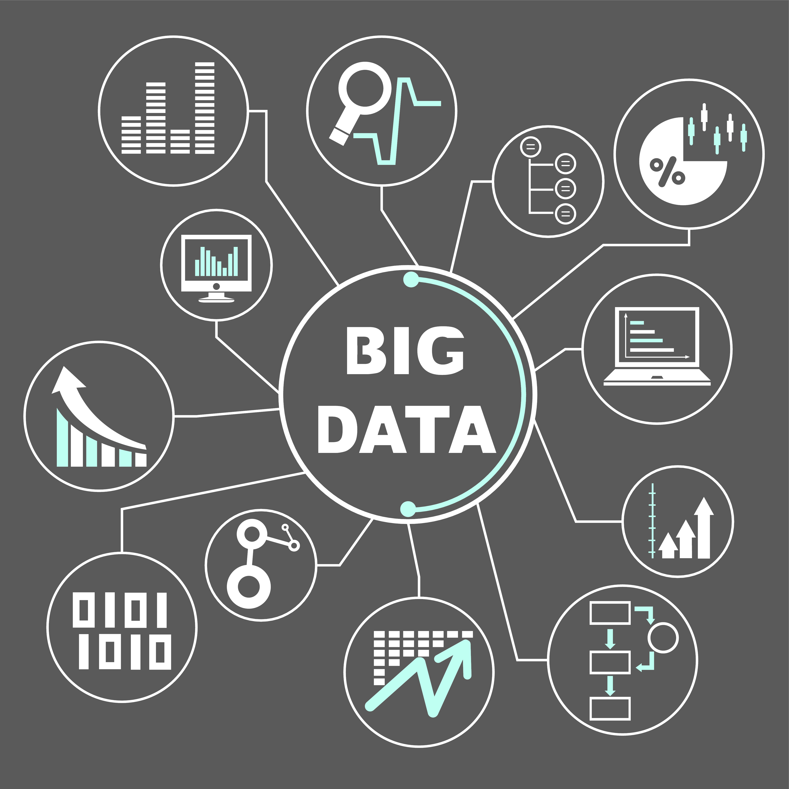
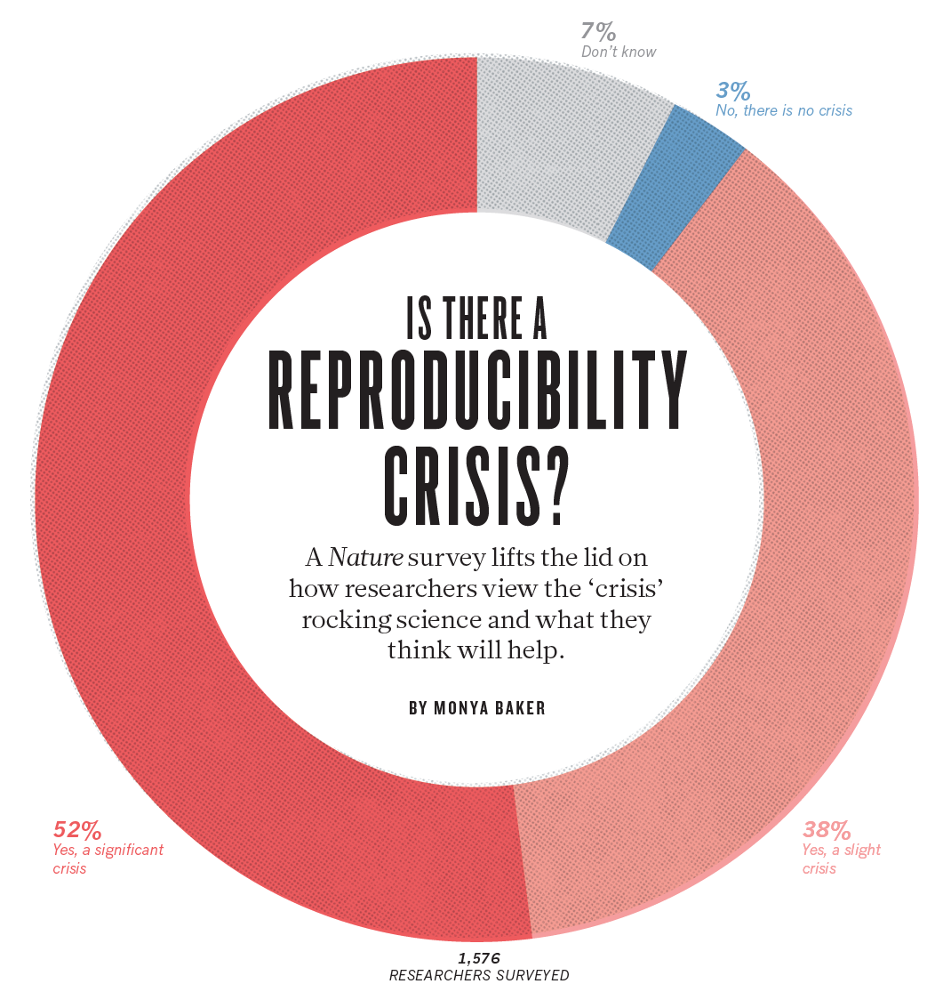
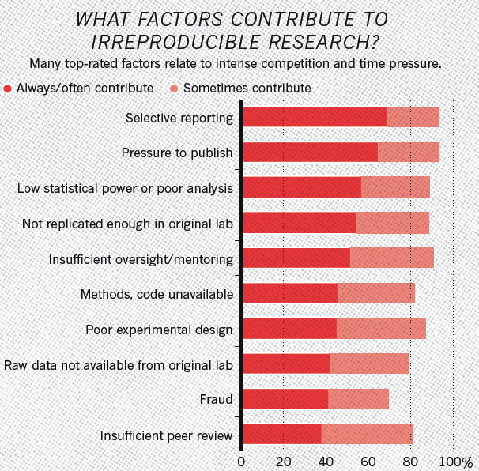

## _Big data_: o futuro da ecologia

* Os dados são centrais em qualquer tipo de pesquisa que seja realizada;
* No cenário atual, existe grande facilidade para armazenagem e acesso à qualquer tipo de dado;
* Integração da evidência disponível é essencial, e será cada vez mais importante no mundo em que viveremos;
* _Big data_: faz referência ao volume massivo de dados que não são manuseados por ferramentas usuais de análise de dados (_ver mais na disciplina de Introdução à Programação em R_), e que compõem uma oportunidade sem precedente para o avanço da ciência, teórica e aplicada;
* Maior parte dos estudos ecológicos são difíceis de serem repetidos (escala temporal e espacial, eventos raros, acesso aos locais,...): __replicagem e reproducibilidade__?

</img>

## A crise de reproducibilidade

* Você é capaz de reproduzir o achado de um trabalho que foi publicado - da produção do dado à sua análise?

</img>

## A crise de reproducibilidade

</img>

## Os maiores desafios em uma RS/MA

## Mudança de Perspectiva

## Regra de Ouro (que ninguém comenta)

## Re-uso dos dados

## Re-uso das conclusões

## Transparência: Seleção de Estudos

## Transparência: Extração de Dados

## Transparência: Análise de Dados

## Transparência: Interpretação dos Resultados

## Transparência: Conclusões

## Resumindo

## Literatura Recomendada

1. Baker & Penny, 2016, Nature, Is there a reprodubility crisis

2. Borer et al, 2009, Bull Ecol Soc Am, Some simple guidelines for effective data management

3. Elison, 2010, Ecology, Repeatability and transparency in ecological research

4. Hampton et al, 2013, Front Ecol Evol, Big data and the future of ecology

5. Parker et al, 2016, Ecol Lett, Promoting transparency in evolutionary biology and ecology

6. Zimmerman, 2008, Sci Tech Human Val, New knowledge from old data - the role of standards in the sharing and reuse of ecological data

7. Rothstein et al, 2013, Quality standards for research syntheses, In: Handbook of meta-analysis in ecology and evolution (Capítulo 20)

8. Lortie et al, 2013, Graphical presentation of results, In: Handbook of meta-analysis in ecology and evolution (Capítulo 21)

