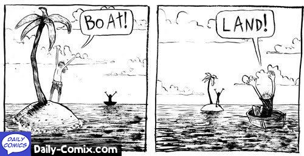

## _Big data_: o futuro da ecologia

* Os dados são centrais em qualquer tipo de pesquisa que seja realizada;
* No cenário atual, existe grande facilidade para armazenagem e acesso à qualquer tipo de dado;
* Integração da evidência disponível é essencial, e será cada vez mais importante no mundo em que viveremos;
* _Big data_: faz referência ao volume massivo de dados que não são manuseados por ferramentas usuais de análise de dados (_ver mais na disciplina de Introdução à Linguagem R_), e que compõem uma oportunidade sem precedente para o avanço da ciência, teórica e aplicada;
* Maior parte dos estudos ecológicos são difíceis de serem repetidos (escala temporal e espacial, eventos raros, acesso aos locais,...): __replicagem e reproducibilidade__?

</img>

## A crise de reproducibilidade

* Você é capaz de reproduzir o achado de um trabalho que foi publicado - da produção do dado à sua análise?

</img>

Fonte: Baker & Penny, 2016, Nature, Is there a reprodubility crisis

## A crise de reproducibilidade

* Não é tanto um problema do desenho do estudo, mas sim __o que você tira dele__ e __como__.

</img>

Fonte: Baker & Penny, 2016, Nature, Is there a reprodubility crisis

## Regra de Ouro (que ninguém comenta)

* __Integridade Científica__ (Richard P. Feynman, Cargo Cult Science): tentar fornecer todos os detalhes e informações para ajudar as outras pessoas à julgar o valor da sua contribuição, e não só a informação que o conduziu ao julgamento em uma direção ou outra.  
    + Detalhes que podem introduzir dúvida na sua contribuição: evidência contra e a favor da sua hipótese;  
    + Fatos que podem tornar sua contribuição inválida: outras causas que podem explicar seus resultados, artefatos que podem existir no seu trabalho;  
    + Qual a evidência sustenta os fatos apresentados pelo seu trabalho: as suas análises estão fazendo direito o que você acha que elas estão fazendo?
    + As implicações do seu trabalho estão enraizadas nos fatos que ele demonstra ou você está tirando coelho da cartola/usando fogos de artifício/fazendo maquiagem?
    + Qual o limite da especulação?
* A ideia é assumir que você está errado, tentar enumerar razões para isso, e buscar invalidar todas elas.    
  

Ainda do Feynman: "The first principle is that you must not fool yourself – and you are the easiest person to fool".

## Os maiores desafios em uma RS/MA

>- __Falta de clareza__: estudos apresentam seu desenho de forma nebulosa;  
>- __Machismo estatístico às avessas__: Análises estatísticas não são conduzidas de forma convencional;  
>- __É só display__: sumários estatísticos dos dados não são apresentados, apenas resultados estatísticos;  
>- __Apresentação seletiva de resultados__: dados são apresentados, mas não seguem o desenho amostral;  
>- __Bomba de fumaça__: reporta 10^_n_^ resultados, que tem pouco haver com a hipótese do trabalho;  
>- __Mágico de Oz__: conclusões têm pouco haver (ou nada haver) com os resultados apresentados.  

## Mudança de Perspectiva

* "Só quem passa pelo deserto sabe o valor de uma chuva": fazer uma revisão sistemática ou meta-análise muda a sua perspectiva de apresentação de um trabalho.  

</img>

## Transparência: Escolha da Pergunta

* A questão (ou problema) está bem definida?
* Está claro por que a questão ou problema apresentados são importantes?
* Está claro como estas questões ou problemas são abordados nos estudos?
* Existe um número relevante de casos que possam ser usados para responder o ponto levantado?

## Transparência: Seleção de Estudos

* Quais os critérios para a seleção e inclusão dos estudos? Eles estão bem definidos?
* Os critérios usados para a seleção e inclusão dos estudos são justificáveis e replicáveis?
* Qual a base de dados utilizada para a busca? Ela é adequada? Quantos casos ela retornou?
* Como você lidou com os artigos selecionados (duplicatas, múltiplos estudos do mesmo experimento,...)?

## Transparência: Seleção de Estudos

* PRISMA Statement (Preferred Reporting Items for Systematic Reviews and Meta-Analyses): 
    + http://prisma-statement.org/Default.aspx
* Fornece diretrizes para apresentação de revisões sitemáticos e meta-análises de forma transparente.  

</img>

## Transparência: Extração de Dados

* Maior parte das revistas na área de ecologia e evolução e algumas agências de fomento fora do Brasil estão requisitando o arquivamento dos dados utilizados/produzidos;  
* O re-uso de dados tem algumas regras a serem seguidas:
    + Dá crédito à quem merece o crédito (seja pelo bom ou mau dado gerado);  
    + Evita que um dado seja 'tomado' sem autorização (todo dado tem um DOI [ou deveria ter]);  
    + Te permite verificar de forma direta o que aqueles números/conjunto de informações conta.
* Alguns conjuntos de dados podem ter datas de embargo;  
* Não deveria ser um problema, mas existem alguns limites impostos por Copyright.  

## Transparência: Extração de Dados

* Como lidar:
    + Definição do controle e tratamento;  
    + Medidas da variável resposta não-independentes (i.e., correlacionadas);  
    + Observações não-independentes: medidas repetidas ao longo do tempo, filogenia, mesmo experimento reportado em múltiplos estudos,...;  
    + Múltiplos níveis de um tratamento;  
    + Ausência de dados quantitativos (usar método de imputação?);
    + Método para extração de dados de figuras.  
* Qual a característica de cada dado extraído?
* Como você manipulou os dados (observações excluídas, agrupamento de níveis das variáveis,...)?
* __Dica:__ um diagrama também pode cair bem aqui.  

## Transparência: Análise de Dados

* Qual a métrica de effect size escolhida? Por que esta métrica de effect size é útil neste caso?
* O tipo de modelo utilizado condiz com o objetivo da meta-análise?
* Os estudos foram ponderados pelo seu peso?
* Você tentou lidar com a não-independência das observações no modelo? Como?
* Como você avaliou a heterogeneidade no modelo?
* Você tentou explicar a heterogeneidade no modelo? Como?
* Você considerou confounding entre moderadores? Usou análises em sub-grupos?
* __Dica:__ um diagrama também pode cair bem aqui.  

## Transparência: Apresentação dos Resultados

* A estimativa do effect size é apresentada junto de seu intervalo de confiança?  
* Você apresentou as estimativas de heterogeneidade entre e dentro dos estudos inclúidos na meta-análise?
* Você tentou identificar outliers ou observações que possam estar tendenciando os resultados?
* Os gráficos utilizados para apresentar os resultados são claros?
* A importância dos moderadores são apresentados no texto ou na forma de figura de forma intuitiva?
* Você tentou avaliar outras fontes de viés nos seus resultados?
    + Funnel Plots, trim-and-fill plots, testes de regressão dos outcomes, histogramas, testes de normalidade,...

## Transparência: Discussão e Conclusões

* Quando usamos uma citação, estamos parafraseando o que de fato o outro pesquisador disse?
* Estudos diferem em qualidade naquilo que mostram:
    + Em uma meta-análise isto é contemplado;
    + Mas e em uma revisão sistemática?
* Propagação de erros por conta de citações erradas pode acontecer sim:
    + Erro no uso de conceitos;  
    + Alteração no significado de conceitos ao longo do tempo;  
    + Resultados mal interpretados;...
* Toda a informação publicada passa a contribuir para uma 'verdade' maior, portanto tenha julgamento muito crítico com:
    + O que você produz;  
    + O que você lê;  
    + O que os outros dizem.  

## Transparência: Discussão e Conclusões

* Qual a interpretação dos resultados à luz de sua significância biológica ou prática?
* Qual a limitação de generalização dos resultados encontrados?
    + Casos contemplados e não contemplados;
    + Originários do tipo de modelo escolhido para a análise de dados.
* O quanto da heterogeneidade encontrada vem de diferenças entre estudos e o quanto vem de características de cada estudo?
* Você identificou áreas pouco representadas na evidência existente? Existem necessidade de mais estudos em determinado sentido?
* Como o seu estudo gera novas hipóteses à serem testadas?

## E depois?

* Os dados que você acumular para uma Revisão Sistemática ou Meta-Análise comporão uma base de dados robusta sobre um determinado tema;
* Se for do seu interesse, mantenha a base de dados atualizada mesmo após a publicação dela: novas perguntas podem acabar aparecendo e/ou perguntas não respondidas agora podem ser respondidas no futuro;
* Você será requisitado para arquivar esta base de dados uma vez que eles sejam publicados: todas as regras de _data sharing_ valem aqui;  
* Esteja preparado para compartilhar esta base de dados com outros pesquisadores: deixe o bebê crescer e ver o mundo.  

## Resumindo

* Revisões Sistemáticas e Meta-Análises são duas ferramentas que podem contribuir com o avanço da ecologia, fornecendo informações baseadas na evidência empírica acumulada e não em exemplos de livro-texto.
* A transparência é fundamental em todo o processo de revisão sistemática/meta-análise: documentação e justificativa de cada etapa. 
* Não se deixe enganar pela sua excitação com os resultados - faça o máximo possível para garantir a veracidade do que você quer mostrar.
* Seja sincero com os resultados e conheça os limites do que pode ser extraído deles.  
* Use o conhecimento que você adquiriu ao realizar uma revisão sistemática/meta-análise para aprimorar a reproducibilidade e transparência de seu próprio trabalho no futuro: alguém pode vir a usar ele um dia.  
* Em uma casca de noz: __prepare o seu trabalho pensando nos outros, e não em você__.
  
## Literatura Recomendada

1. Baker & Penny, 2016, Nature, Is there a reprodubility crisis

2. Borer et al, 2009, Bull Ecol Soc Am, Some simple guidelines for effective data management

3. Elison, 2010, Ecology, Repeatability and transparency in ecological research

4. Hampton et al, 2013, Front Ecol Evol, Big data and the future of ecology

5. Parker et al, 2016, Ecol Lett, Promoting transparency in evolutionary biology and ecology

6. Zimmerman, 2008, Sci Tech Human Val, New knowledge from old data - the role of standards in the sharing and reuse of ecological data

7. Rothstein et al, 2013, Quality standards for research syntheses, In: Handbook of meta-analysis in ecology and evolution (Capítulo 20)

8. Lortie et al, 2013, Graphical presentation of results, In: Handbook of meta-analysis in ecology and evolution (Capítulo 21)

9. Richard P. Feynman, Cargo Cult Science: http://calteches.library.caltech.edu/51/2/CargoCult.htm